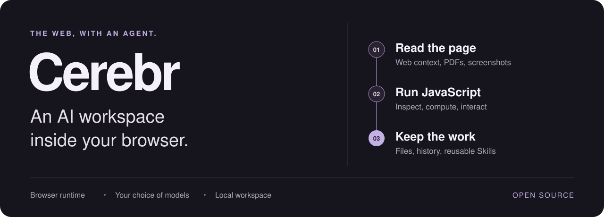
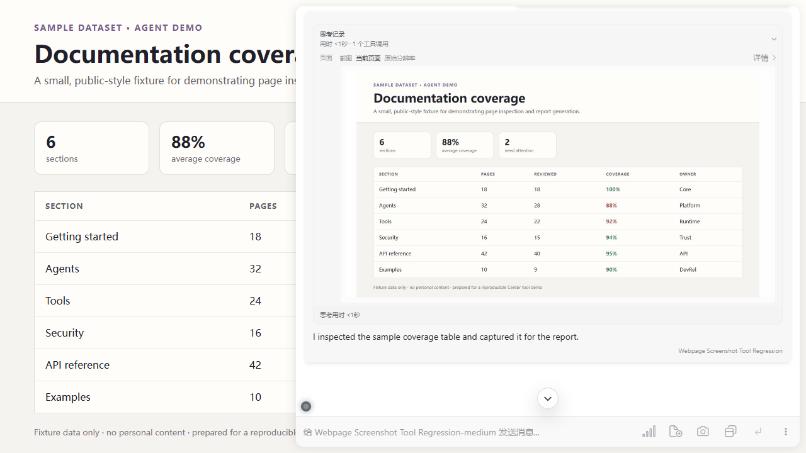
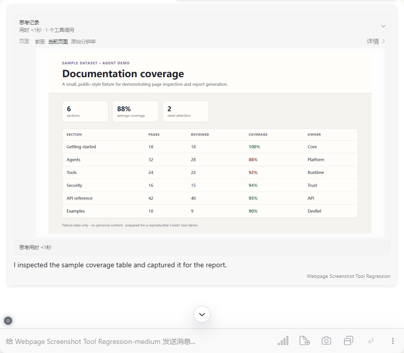

<h1 align="center">Cerebr</h1>

<p align="center"><strong>An open-source AI workspace inside your browser.</strong></p>
<p align="center">Read the web. Run JavaScript. Build reusable Skills. Keep your work.</p>

<p align="center">
  <strong>English</strong> · <a href="./README_ZH.md">简体中文</a><br />
  <a href="#what-you-can-do">Explore</a> · <a href="#quick-start">Quick start</a> · <a href="./docs/agent-guide.md">Agent guide</a> · <a href="https://github.com/oyasumiaiko/Cerebr/issues">Feedback</a>
</p>

<p align="center">
  
</p>

Cerebr brings an AI agent into the page you are already using. It can read page content, write and execute JavaScript against the live DOM, work with persistent conversation files, and turn repeatable workflows into Skills—all from a Chrome sidebar.

**The agent runtime and workspace run in the browser.** Models connect through your configured API provider; no separate Cerebr backend or local automation server is required.

## Why Cerebr

The browser is where much of our work already lives: documentation, articles, dashboards, PDFs, and web applications. Cerebr connects that context to an agent that can inspect it, act on it, and save useful results in the same workspace.

- **Work with the actual page.** Inspect DOM elements, extract structured data, compute over it, and interact with page controls through JavaScript.
- **Teach it a workflow once.** Package instructions, resources, and browser methods into reusable Skills that can match specific websites.
- **Keep more than the answer.** Save editable files alongside conversations, search previous work, and explore side questions in branches and selection threads.
- **Choose your models.** Connect OpenAI Responses, OpenAI-compatible Chat Completions, or Gemini. Use Responses in Enhanced mode for the local agent tool loop.

## What you can do

These example prompts illustrate workflows supported by Cerebr's tools. Page interaction depends on the site's DOM, browser permissions, and the selected model.

| Workflow | Try asking |
| --- | --- |
| **Turn a page into usable data** | “Extract this table, normalize the values with JavaScript, and save the result as a CSV conversation file.” |
| **Work through a web interface** | “Inspect this page's filters, select the options I describe, and report what changed.” |
| **Read with context** | “Summarize this PDF, explain the selected passage, and keep my follow-up in a separate thread.” |
| **Build a reusable website Skill** | “Save this extraction workflow as a Skill I can use on this site again.” |
| **Continue earlier research** | “Find our previous discussion of this topic and turn the relevant findings into an editable Markdown note.” |
| **Get a second model's view** | “Ask another configured model to critique this explanation, then compare the answers.” |

### From a web page to a working result

Read a table, calculate coverage, highlight the rows that need attention, and save a report without leaving the page.

<p align="center">
  
</p>

<details>
<summary><strong>A closer look at the agent workspace</strong></summary>

<p align="center">
  
</p>

</details>

*Reproducible demo with sample data and scripted model responses. JavaScript and file tools execute in the real extension. Interface controls currently use Chinese; full English UI localization is not yet available.*

## A browser agent you can extend

### JavaScript that works with the page

In a bound page, `js_runtime_execute` runs model-written JavaScript in Chrome's user-script environment, with access to the page DOM and browser Web APIs. The model can inspect structure, extract data, perform calculations, and interact with elements. Results, logs, and errors return to the conversation so it can decide what to do next.

The runtime supports `await`, explicit state reuse across calls, and accessible frames. When no host page is bound, an isolated JavaScript sandbox handles computation and parsing. Page execution has no local shell access; provider-hosted Python is a separate, optional capability.

### Skills that grow with your workflow

A Skill combines a `SKILL.md` instruction file with optional scripts, references, and assets. Guidance Skills describe how to approach a task; page-runtime Skills expose reusable JavaScript methods and URL matching. The agent can create and maintain these packages, then invoke their methods with `$invoke(...)`.

The Skill manager lets you inspect files, enable or disable a Skill, remount it on the current page, and export the complete package as a ZIP.

### A workspace that keeps the results

Conversation files support reading, search, copying, and atomic `apply_patch` edits. You can also mount local files or folders read-only. Chats, files, and Skills persist in local IndexedDB, with history search, branching, import/export, and backup tools for continued work.

### Native OpenAI Responses support

Cerebr implements the Responses request and streaming lifecycle, including repeated local tool execution and follow-up requests. You can inspect tool activity, see errors, answer structured questions, and steer a running task.

It also exposes reasoning controls, structured output, context compaction, deferred tool loading, and optional provider-hosted web search, Code Interpreter, and image generation. Hosted capabilities depend on the configured endpoint.

See the **[agent guide](./docs/agent-guide.md)** for API settings and runtime details, or the **[tool contract](./docs/model-tools-contract.md)** for exact schemas, file semantics, and execution boundaries.

## Quick start

You need a current version of Chrome and an API endpoint and key for your chosen model. Cerebr currently installs from source as an unpacked extension.

1. Clone the repository with its bundled asset submodule:

   ```sh
   git clone --recurse-submodules https://github.com/oyasumiaiko/Cerebr.git
   cd Cerebr
   ```

2. Open `chrome://extensions`, enable **Developer mode**, choose **Load unpacked**, and select the repository folder.
3. For page JavaScript execution, enable **Allow User Scripts** in the extension details if Chrome displays that switch.
4. Open a normal web page and click the Cerebr extension icon. In **API Settings**, add your provider, API key, and model.
5. To use the agent tools, select **OpenAI Responses** and **Enhanced mode**. Start with: “Read this page and explain what you can help me do here.”

There is no build step. If you cloned without submodules, run `git submodule update --init --recursive`. Keyboard shortcuts can be configured at `chrome://extensions/shortcuts`.

### Models and connections

| Connection | Use it for |
| --- | --- |
| **OpenAI Responses** | The local agent workflow, reasoning controls, structured output, and supported hosted tools |
| **OpenAI-compatible Chat Completions** | Streaming conversations with compatible providers and custom request parameters |
| **Gemini** | Native Gemini conversations, images, and thinking settings |

Multiple providers and model configurations can coexist. **Pure Chat** mode sends explicit conversation messages without injecting page context or executing tools.

### Your data and permissions

Chat history, conversation files, and Skills primarily live in local IndexedDB. API keys and configuration use Chrome extension storage, including Chrome Sync where enabled. Model requests and hosted tools send the relevant data to the services you configure; local storage does not mean offline inference.

Page scripts can read and change the current page. Review the [extension permissions](./manifest.json), choose which tools to enable, and use Skills whose code you trust. Execution environments and tool behavior are documented in the [agent guide](./docs/agent-guide.md#code-execution).

## Built in the open

Cerebr uses **Manifest V3, native JavaScript ES modules, and CSS**, with bundled frontend libraries and no build pipeline. Its browser runtime, tool contracts, and persistence layer are available to inspect and adapt.

| Area | Source |
| --- | --- |
| Browser integration, JavaScript runtime, Skills | [`src/extension/`](./src/extension/) |
| Agent lifecycle, messages, conversation state | [`src/core/`](./src/core/) |
| API protocols and model settings | [`src/api/`](./src/api/) |
| Local tools and their contracts | [`src/agent_tools/`](./src/agent_tools/) |
| Sidebar, previews, settings, history | [`src/ui/`](./src/ui/) |
| Persistence and regression coverage | [`src/storage/`](./src/storage/) · [`tests/`](./tests/) |

For contributors, run the Node regression suite with `node --test tests/*.test.cjs`. Browser regressions use the Chrome/Playwright harnesses in [`tests/lib/`](./tests/lib/) and exercise the sidebar embedded in a real host page. See [repository guidelines](./AGENTS.md) for the development workflow.

Bug reports, reproducible browser cases, Skill examples, documentation improvements, and focused pull requests are welcome. [Open an issue](https://github.com/oyasumiaiko/Cerebr/issues) or [explore the development history](https://github.com/oyasumiaiko/Cerebr/commits/main/).

## Origins and license

This project began as a fork of [yym68686/Cerebr](https://github.com/yym68686/Cerebr) and is independently maintained by [oyasumiaiko](https://github.com/oyasumiaiko). It has since evolved into a browser agent workspace with JavaScript execution, reusable Skills, conversation files, and native Responses tool orchestration. Thanks to the original author and contributors for the foundation.

Released under the [GNU General Public License v3.0](./LICENSE).
